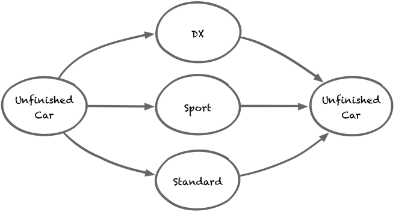

graphs

# Exercise 6 > Graphs

In this exercise, we will introduce a simple graph into our flow.

## Upgrade Shop

Up to this point, all of our cars have been built with the same standard
packaging. However sometimes we may want a car to include an upgrade package
such as a better stereo, better interior features etc. These upgrades will be
performed in the Upgrade Shop.

- Create a class called `UpgradeShop` with an empty constructor.
- Create a val in `UpgradeShop` named `installUpgrades` that returns a
  `Flow`[`UnfinishedCar`,`UnfinishedCar`,`NotUsed`].
- Implement the `installUpgrades` such that it accepts an incoming
  `UnfinishedCar`, then splits the stream into 3 **balanced** paths.
   One path will install a `Upgrade`.`DX`. The other path will install an
  `Upgrade`.`Sport`. The final path will not install any upgrades. The 
  resulting three streams should then be **merged** back into a single stream.
- **HINT** What kind of **Shape** do you need to return?

## Factory

Now that we have a place to do our upgrades, we need to integrate it into the
factory.

- In `Factory`, add a constructor parameter of type `UpgradeShop`.
- Modify the `orderCars` method to pass the `UnfinishedCars` through the
  `installUpgrades` flow. Where does inserting the upgrade installation
  make sense?
- **HINT** Have a look at the system diagram.

Use the `test` command to verify the solution works as expected.  
Use the `nextExercise` command to move to the next exercise.
